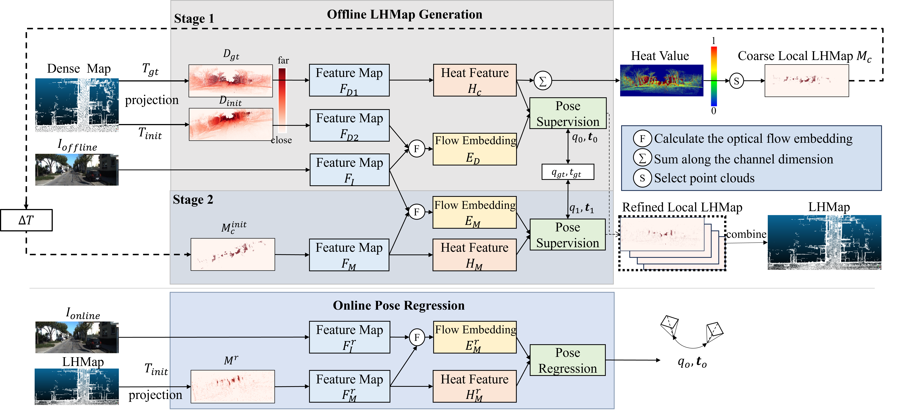

# GCMLoc: Monocular Vehicle Localization with LiDAR Maps via Semantic Enhancement and Global Coarse-to-Fine Cross-Modal Match

[](#citation)
[](https://arxiv.org/abs/2403.05002)
[](LICENSE)
[](https://www.python.org/downloads/)
[](https://pytorch.org/)

## Abstract

Estimating the six-degree-of-freedom pose of a monocular camera against a pre-built
LiDAR point-cloud map is hindered by the modality gap between dense RGB imagery and
sparse depth representations. GCMLoc is a two-stage cross-modal localization framework
in which an offline *mapping* stage learns a per-frame map-feature representation from
accumulated LiDAR scans, and an online *localization* stage iteratively refines the
camera pose through cross-modal matching between the image and the projected map.
Semantically discriminative image features are extracted by a DINOv2 Vision Transformer
backbone, while map and geometric cues are encoded by a multi-branch convolutional
network; the two modalities are integrated by a cross-modal semantic–geometric fusion
module and aligned by a multi-scale flow matcher (GCM-Flow) that combines global
correlation at the coarsest scale with local warping at finer scales. The framework is
implemented as a single unified pipeline supporting the KITTI Odometry and Argoverse
benchmarks as well as a mixed-dataset training regime, and is released to facilitate
reproducible research on cross-modal visual localization.

> **中文摘要：** GCMLoc 為一兩階段跨模態定位框架，用於估計單眼相機相對於預建 LiDAR
> 點雲地圖的 6-DoF 位姿。離線「建圖」階段由累積的 LiDAR 點雲學習每幀地圖特徵；線上
> 「定位」階段透過影像與投影地圖之間的跨模態匹配迭代修正位姿。影像特徵由 DINOv2
> 視覺 Transformer 提取，地圖與幾何特徵由多分支卷積網路編碼，兩者經跨模態語意–幾何
> 融合模組整合，並由結合全域相關與多尺度局部 warp 的 GCM-Flow 光流匹配器對齊。整體
> 以單一統一管線實作，支援 KITTI Odometry、Argoverse 及混合資料集訓練。

## News / Updates

- **[2026-07]** Initial public release of the GCMLoc codebase (KITTI / Argoverse / ITRI-campus, single- and mixed-dataset training).
- **[2024-06]** The foundational method, *LHMap-loc*, was presented at IEEE ICRA 2024 (doi: 10.1109/ICRA57147.2024.10610718).
- **[2024-03]** The foundational preprint was released on arXiv ([2403.05002](https://arxiv.org/abs/2403.05002)).

## Overview



*Two-stage cross-modal localization pipeline. An offline mapping stage constructs
per-frame map features from accumulated LiDAR point clouds; an online localization
stage performs iterative pose refinement through cross-modal matching.*

The model is organised into the following components. The default configuration of every
script is the **final GCMLoc model** (DINOv2 ViT-B/14 with the last 4 blocks unfrozen,
CNN depth branch, cross-modal fusion, multi-scale GCM-Flow); alternative components can
be selected through configuration flags for ablation studies:

| Stage | Component | Implementation |
|-------|-----------|----------------|
| Mapping (offline) | RGB backbone | DINOv2 ViT-S/14 (384-d) or ViT-B/14 (768-d); fully frozen or with the last *N* transformer blocks unfrozen. A convolutional backbone is also provided. |
| Mapping (offline) | Map / geometry branch | Three-branch convolutional network (`branch_gt`, `branch_init`, `branch_lhmap`). An experimental VMamba branch is included but disabled by default. |
| Mapping (offline) | Fusion | Cross-modal semantic–geometric fusion (optional). |
| Mapping (offline) | Flow matcher | GCM-Flow multi-scale matcher (global correlation + local warp), or a PWC-style local correlation variant. |
| Both stages | Objectives | Pose regression loss, multi-scale flow-supervision loss, anchor loss, and heatmap entropy regularisation. |
| Localization (online) | Pose head | Iterative pose regression initialised from the previous iteration. |

> The internal module names `branch_lhmap`, `head_lhmap`, and `proj_lhmap` are retained
> for backward compatibility with previously trained checkpoints.

## Installation

### Prerequisites

| Requirement | Version |
|-------------|---------|
| Python | 3.10 |
| PyTorch | 2.5.1 + CUDA 12.1 |
| CUDA toolkit | 12.1 (required to build the custom extensions) |
| GPU | ≥ 24 GB VRAM recommended |

### Environment setup

```bash
# 1. Create and activate a conda environment
conda create -n gcmloc python=3.10 -y
conda activate gcmloc

# 2. Install PyTorch (CUDA 12.1)
pip install torch==2.5.1+cu121 torchvision==0.20.1+cu121 torchaudio==2.5.1+cu121 \
    --extra-index-url https://download.pytorch.org/whl/cu121

# 3. Install the remaining dependencies
pip install -r requirements.txt

# 4. Build the CUDA visibility extension (LiDAR point-visibility computation)
python setup.py build_ext --inplace

# 5. Build the correlation CUDA extension (used by the local-correlation flow variant)
cd models/GCMLoc/correlation_package
pip install -e .
cd ../../..
```

Key dependencies (see `requirements.txt` for the complete, pinned list): `torch==2.5.1+cu121`,
`numpy==2.2.6`, `sacred==0.8.7`, `mathutils==3.3.0`, `open3d==0.19.0`, `opencv-python`,
`timm==0.4.12`, `pandas`, `matplotlib`, `h5py`, `scipy`, `tqdm`.

## Quick Start

Verify that the compiled extensions and GPU are available:

```bash
python -c "import visibility, torch; print('visibility OK; CUDA available:', torch.cuda.is_available())"
```

Configuration is managed with [Sacred](https://github.com/IDSIA/sacred); parameters are
overridden on the command line using the `with key=value` syntax. A minimal evaluation
run on a single KITTI sequence, given a trained localization checkpoint and pre-saved
map features, is invoked as follows:

```bash
python evaluate.py with \
    dataset=kitti data_folder=./KITTI_ODOMETRY/sequences test_sequence=0 split=test \
    maps_folder=v2_pcl max_r=10 max_t=2 \
    "weight=['<loc_checkpoint>.tar']" results_dir=./results
```

The network architecture is rebuilt automatically from the configuration stored inside
each checkpoint. The script reports the median translation and rotation errors over the
evaluated sequence and writes a `summary.txt` file to `results_dir`.

## Dataset and Model Preparation

Datasets are not distributed with this repository and must be obtained from their
official sources. The `data_folder` argument is pointed at the corresponding dataset root.

### KITTI Odometry

The framework is evaluated on the [KITTI Odometry benchmark](http://www.cvlibs.net/datasets/kitti/eval_odometry.php).
The expected directory layout is:

```
KITTI_ODOMETRY/
└── sequences/
    ├── 00/
    │   ├── image_2/        # left camera images
    │   ├── velodyne/       # LiDAR scans (.bin)
    │   └── poses.csv       # ground-truth poses
    ...
```

Ground-truth pose files are pre-provided in `data/kitti-{seq}.csv`. A voxelised
point-cloud map is constructed per sequence with:

```bash
python preprocess/kitti_maps.py --sequence 00 --kitti_folder ./KITTI_ODOMETRY --voxel_size 0.1
```

### Argoverse

Argoverse is selected with `dataset=argo` and `data_folder=./data/argoverse-tracking`.
The corresponding dataset loaders are `Dataset_argoverse_mapping.py` and
`Dataset_argoverse_localization.py`.

### ITRI-campus

The ITRI-campus dataset (front dash camera + pre-built LiDAR point-cloud map) is used as
an unseen deployment domain for the mixed-trained model. The preprocessing pipeline in
`preprocess/` builds the working directory `iter_campus/` (global `map.h5`, undistorted
images, per-frame `cam_T_map` poses, pinhole calibration):

```bash
ITRI_SRC_ROOT=<path/to/itri_campus> ITRI_DEST_ROOT=./iter_campus \
    bash preprocess/run_all.sh
```

ITRI is then selected with `dataset=itri` and `data_folder=./iter_campus`
(`Dataset_itri_mapping.py` / `Dataset_itri_localization.py`).

### Fixed test-time initial offsets (`data/test_RT/`)

At test time every frame is perturbed by a **fixed** initial pose offset read from a
`test_RT_*.csv` file (columns `id, tx, ty, tz, rx, ry, rz`), so that all methods are
evaluated from *identical* initial displacements. The exact CSVs used in our experiments
are shipped in `data/test_RT/{kitti,argoverse,itri}/`. Before running evaluation, copy
them into the corresponding dataset root, where the data loaders look for them:

```bash
cp data/test_RT/kitti/*.csv     ./KITTI_ODOMETRY/sequences/
cp data/test_RT/argoverse/*.csv ./data/argoverse-tracking/
cp data/test_RT/itri/*.csv      ./iter_campus/
```

If a `test_RT` CSV is missing, the loader generates a new random one — results are then
still valid but no longer frame-by-frame comparable with the published numbers. When
comparing your own method against GCMLoc, please use these CSVs as the initial offsets.

### Mixed-dataset training

A combined regime that jointly samples KITTI and Argoverse is provided through
`combined_dataset.py` and is enabled with `dataset=mixed`, `use_canonical=True`,
`kitti_data_folder=...`, and `argo_data_folder=...`. All images are warped to a canonical
virtual camera (`canon_preset=A`, 768×384), and the two datasets are drawn under a
weighted sampler controlled by `mixed_weight_kitti` and `mixed_weight_argo`. The same
`canon_preset` must be used consistently across mapping training, map saving,
localization training, and evaluation.

## Training

The pipeline comprises four steps: **mapping → map-feature saving → localization →
evaluation.** Default hyperparameters are defined in each script's `@ex.config` block and
may be overridden on the command line.

All commands below run the final GCMLoc architecture by default — no architecture flags
are needed.

### Step 1 — Offline mapping

```bash
python train_mapping.py with \
    dataset=kitti data_folder=./KITTI_ODOMETRY/sequences test_sequence=0 \
    epochs=120 batch_size=8 max_r=10 max_t=2 BASE_LEARNING_RATE=1e-4
```

### Step 2 — Map-feature saving

```bash
python train_save.py with \
    dataset=kitti data_folder=./KITTI_ODOMETRY/sequences test_sequence=0 \
    weights=<mapping_checkpoint>.tar \
    save_root=./KITTI_ODOMETRY/sequences save_name=v2_pcl save_split=test batch_size=8
```

`save_name=v2_pcl` is the folder name that the localization stage reads by default
(`maps_folder=v2_pcl`). `run_all_saves.sh` batches this step over all sequences/splits
of a dataset (`bash run_all_saves.sh [kitti|argo|itri]`).

### Step 3 — Online localization (iterative)

```bash
python train_loc.py with \
    dataset=kitti data_folder=./KITTI_ODOMETRY/sequences test_sequence=0 \
    maps_folder=v2_pcl weights=<mapping_checkpoint>.tar \
    epochs=300 batch_size=8 max_r=10 max_t=2
```

Localization is trained iteratively with progressively reduced perturbation ranges; each
round is initialised from the best checkpoint of the previous round (`weights=` points at
the mapping checkpoint in round 1 and at the previous round's best checkpoint afterwards):

| Iteration | `max_r` (deg) | `max_t` (m) |
|:---------:|:-------------:|:-----------:|
| 1 | 10.0 | 2.0 |
| 2 | 2.0 | 1.0 |
| 3 | 1.0 | 0.6 |

**Selected hyperparameters** (defaults; see `@ex.config` for the full set):

| Parameter | Default | Description |
|-----------|---------|-------------|
| `BASE_LEARNING_RATE` | `1e-4` | Base learning rate (Adam optimiser). |
| `dinov2_lr_scale` | `0.01` | Learning-rate multiplier applied to unfrozen DINOv2 blocks. |
| `unfreeze_dinov2_blocks` | `4` | Number of trailing DINOv2 blocks left trainable. |
| `lr_scheduler` | `multistep` | `multistep` (milestones `[20, 50, 70]`, `gamma=0.5`) or `cosine`. |
| `feat_dim` | `128` | Feature dimensionality. |
| `topk_points` | `5000` | Number of map points retained per frame. |
| `max_t` / `max_r` | `2.0` / `10.0` | Translation / rotation perturbation ranges for augmentation. |
| `flow_loss_weight` | `0.0` | Weight of the flow-supervision loss (`>0` enables it). |
| `use_amp` | `False` | Mixed-precision training (reported to degrade pose accuracy). |

### Mixed-dataset pipeline (KITTI + Argoverse → ITRI-campus generalisation)

The full mixed regime follows the same four steps, with `dataset=mixed` and canonical
warping enabled throughout (one consistent `canon_preset`):

```bash
# 1) Offline mapping, jointly trained on KITTI + Argoverse
python train_mapping.py with \
    dataset=mixed use_canonical=True canon_preset=A \
    kitti_data_folder=./KITTI_ODOMETRY/sequences \
    argo_data_folder=./data/argoverse-tracking \
    kitti_maps_folder=local_maps_0.1 maps_folder=argo_local_maps_0.1 \
    mixed_weight_kitti=1.0 mixed_weight_argo=2.0 \
    epochs=120 batch_size=8
#    → produces <MAP_CKPT>

# 2) Save map features for both datasets (train and test splits)
bash run_all_saves.sh kitti     # edit WEIGHTS=<MAP_CKPT> inside the script
bash run_all_saves.sh argo

# 3) Online localization, jointly trained on KITTI + Argoverse
python train_loc.py with \
    dataset=mixed use_canonical=True canon_preset=A \
    kitti_data_folder=./KITTI_ODOMETRY/sequences \
    argo_data_folder=./data/argoverse-tracking \
    maps_folder=v2_pcl mixed_weight_kitti=1.0 mixed_weight_argo=2.0 \
    weights=<MAP_CKPT> epochs=300 batch_size=8
#    → produces <LOC_CKPT>

# 4) Save map features for the unseen ITRI-campus domain, then evaluate
bash run_all_saves.sh itri
python evaluate.py with dataset=itri use_canonical=True canon_preset=A \
    data_folder=./iter_campus maps_folder=v2_pcl split=test \
    "weight=['<LOC_CKPT>']"
```

Note: for `dataset=itri` the loader does **not** fall back to on-the-fly map cropping —
if the saved `.npy` map features are missing it raises an error listing the expected
paths (run step 4's saving first, or pass `maps_folder=''` explicitly).

## Evaluation

Iterative evaluation applies a sequence of localization checkpoints, each refining the
estimate from the previous iteration:

```bash
python evaluate.py with \
    dataset=kitti data_folder=./KITTI_ODOMETRY/sequences test_sequence=0 split=test \
    maps_folder=v2_pcl max_r=10 max_t=2 \
    "weight=['<iter1>.tar','<iter2>.tar','<iter3>.tar']" results_dir=./results
```

To evaluate one mixed-trained checkpoint set across several datasets in a single
invocation (per-dataset sub-folders plus a combined `summary_all.txt`):

```bash
python evaluate_multidataset.py with \
    "datasets=['kitti','argo','itri']" \
    "weight=['<iter1>.tar','<iter2>.tar','<iter3>.tar']" \
    use_canonical=True canon_preset=A \
    maps_folder=v2_pcl max_r=10 max_t=2 results_root=./results_mixtest
```

`infer_loc.py` provides a lightweight single-checkpoint variant of the same evaluation.

**Reported metrics.** Localization accuracy is measured by the *median translation error*
(the median over per-frame Euclidean translation residuals, in metres) and the *median
rotation error* (the median over per-frame quaternion geodesic distances, in degrees).

**Results.**

| Dataset | Iteration | Median Transl. Error (m) | Median Rot. Error (deg) |
|---------|:---------:|:------------------------:|:-----------------------:|
| KITTI Odometry | 1 | *to be reported* | *to be reported* |
| KITTI Odometry | 2 | *to be reported* | *to be reported* |
| KITTI Odometry | 3 | *to be reported* | *to be reported* |

> Quantitative results are produced by the evaluation script above and are left to be
> populated by the user; no numbers are reported here that have not been independently
> reproduced.

## Pretrained Weights

Pretrained checkpoints will be provided via Google Drive:

| Checkpoint | Description | Link |
|------------|-------------|------|
| `mapping.tar` | Stage-1 mapping network (mixed KITTI + Argoverse, canonical preset A) | *coming soon* |
| `loc_iter1.tar` / `loc_iter2.tar` / `loc_iter3.tar` | Stage-2 localization checkpoints for the three refinement iterations | *coming soon* |

Place the downloaded files under `./checkpoints/` (the default paths used by the example
commands above). Each checkpoint embeds its architecture configuration, so no additional
flags are required to load it.

## Repository Structure

```
GCMLoc/
├── train_mapping.py            # Stage-1 mapping training (single or mixed dataset)
├── train_save.py               # Save map features (.npy) from a mapping checkpoint
├── train_save_eachtime.py      # Stage-1 per-module timing variant (no files saved)
├── train_loc.py                # Stage-2 localization training (single or mixed)
├── evaluate.py                 # Iterative evaluation + per-module timing
├── evaluate_multidataset.py    # One checkpoint set evaluated across datasets
├── infer_loc.py                # Single-checkpoint inference
├── run_all_saves.sh            # Batch map-feature saving (kitti / argo / itri)
├── Dataset_{kitti,argoverse,itri}_{mapping,localization}.py
├── combined_dataset.py         # Weighted mixed-dataset sampler
├── camera_model_{mapping,localization}.py
├── utils.py / utils_canonical.py / quaternion_distances.py / timing_record.py
├── models/
│   ├── GCMLoc/                 # GCMLoc mapping / localization / save networks
│   │   └── correlation_package/  # CUDA correlation op (CMRNet heritage)
│   ├── backbone/               # DINOv2 wrapper, VMamba backbone
│   ├── fusion/                 # Cross-modal fusion, global correlation, GCM-Flow
│   └── heads/                  # Heatmap head, pose regressor
├── losses/                     # Pose / flow / anchor / entropy losses
├── preprocess/                 # KITTI map building + ITRI-campus pipeline
├── src/ + setup.py             # CUDA visibility extension
├── data/kitti-*.csv            # KITTI ground-truth poses
├── data/test_RT/               # Fixed test-time initial offsets (see above)
└── fig/                        # Architecture figure
```

## Citation

A publication describing GCMLoc is in preparation; the citation will be provided upon
release **[Paper link TBD]**. In the meantime, please cite the foundational method on
which this framework is built:

```bibtex
@inproceedings{lhmaploc2024,
  author    = {Wu, Xinrui and Xu, Jianbo and Hu, Puyuan and Wang, Guangming and Wang, Hesheng},
  title     = {{LHMap-loc}: Cross-Modal Monocular Localization Using {LiDAR} Point Cloud Heat Map},
  booktitle = {2024 IEEE International Conference on Robotics and Automation (ICRA)},
  pages     = {8500--8506},
  year      = {2024},
  doi       = {10.1109/ICRA57147.2024.10610718}
}
```

## License

This project is released under the [MIT License](LICENSE). Portions of the codebase are
derived from **CMRNet** (Università degli Studi di Milano-Bicocca, iralab) and are
governed by the [CC BY-NC-SA 4.0](http://creativecommons.org/licenses/by-nc-sa/4.0/)
license; see `setup.py`, `preprocess/kitti_maps.py`, the dataset loaders, and
`models/GCMLoc/correlation_package/LICENSE`.

## Acknowledgements

This codebase builds upon [CMRNet](https://github.com/cattaneod/CMRNet) for the
cross-modal registration foundation, and incorporates the
[DINOv2](https://github.com/facebookresearch/dinov2) image backbone together with global
correlation concepts from [GMFlow](https://github.com/haofeixu/gmflow). The KITTI dataset
is provided by the Karlsruhe Institute of Technology and the Toyota Technological
Institute at Chicago; the Argoverse dataset is provided by Argo AI.
